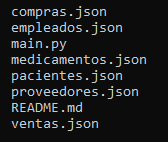

# Farmacia 

Este sistema integral de gestión ha sido desarrollado para una farmacia con el objetivo de manejar todas las operaciones relacionadas con la administración de medicamentos, proveedores, empleados, pacientes, así como la generación de informes relevantes. 

## Funcionalidades 

1. Gestión de Ventas:

    - Registro de cada transacción de venta.
    - Información incluida en el registro:
        * Fecha de la venta.
        * Información del paciente (nombre, dirección).
        * Información del empleado que realizó la venta (nombre, cargo).
        * Medicamentos vendidos (nombre, cantidad, precio).

2. Gestión de Compras:

    - Registro de cada compra realizada a los proveedores.
    - Información incluida en el registro:
        * Fecha de la compra.
        * Información del proveedor (nombre, contacto).
        * Medicamentos comprados (nombre, cantidad, precio de compra).

## Estructura

La estructura cuenta con varios *.json* cada uno tiene una funcionalidad diferente:

| .json |  Funcion |
|--|--|
|compras.json | Este archivo guarda los registros de compras realizadas a los proveedores. |
|empleados.json | Este archivo guarda el nombre, el cargo y la fecha de contratación. |
|medicamentos.json | Este archivo gusda el nombre, precio, stock, fecha de expiracion y proveedor. |
|pacientes.json| Este archivo guarda el nombre, direccion y telefono.  |
|proveedores.json | Este archivo guarda el nombre, contacto y direccion. |
|ventas.json| Este archivo guarda las fechas, datos del cliente, empleado y medicamentos vendidos. |

## Lenguajes de uso  

  
    
## Instalación 

1. Instalar visual code, git y python 
2. Clonar repositorio 

## Creditos 

    Elaborado por Zully Fernanda Ortiz Avendaño 